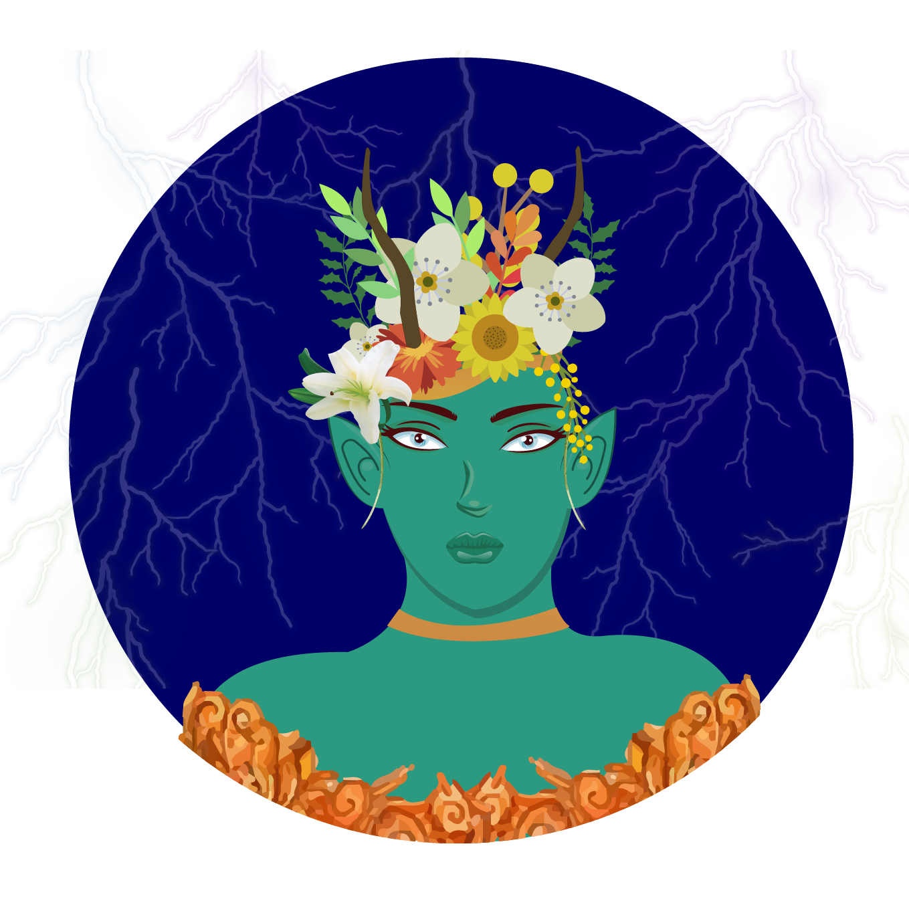

  
   

# GAIA

A Gaia é um chatbot desenvolvido em RASA e NODEJS com o objetivo auxiliar a vida de praticantes de atividas ao ar livre. Por meio de interpretação de linguagem natural, o usuário poderá receber informações a respeito das condições climáticas em tempo real. A Gaia fornecerá informações por meio de notificação e também sugestões de melhores esportes de acordo com o clima. 

A Gaia tem como principais funcionalidades:

- Indicação de esportes de acordo com o clima.
- Exibição das condições climáticas atuais.
- Previsão do tempo de até cinco dias. 
- Notificações de condições climáticas atuais e previsão do tempo.

# Encontre a Gaia

Você pode conversar com a Gaia pelo Telegram com o [@GaiaHmlBot](https://t.me/GaiaHmlBot) e futuramente pelo Facebook!

# Quer contribuir para o projeto? 

A Gaia é construída com microsserviços. Cada um deles possui seu próprio repositório, com instruções de configuração e execução. Esses microsserviços podem ser encontrados na [organização](https://github.com/BotGaia). É bem simples saber como contribuir para o projeto, acesso o nosso [Guia de Contribuição](https://github.com/fga-eps-mds/2019.1-Gaia/blob/master/CONTRIBUTING.md). Caso tenha alguma dúvida, não se desespere, abra uma issue!

## Está com dúvida sobre o código de conduta para contribuir? Acesse [aqui](https://github.com/fga-eps-mds/2019.1-Gaia/blob/master/CODE_OF_CONDUCT.md)

## TIME

| Nome | Papel | GitHub |
| --------- | -------- | -------- |
| Amanda | Arquiteta | [@AmandaMuniz](https://github.com/AmandaMuniz) |
| Calebe | DevOps | [@caleberios](https://github.com/caleberios) |
| Indiara | Produt Owner | [@inddiara](https://github.com/inddiara) |
| Luciana | Tech Lead | [@lucianaribeiro](https://github.com/lucianaribeiro) |
| Eduardo | Dev | [@Ed-vL](https://github.com/Ed-vL) |
| Luís | Dev | [@LhTaira](https://github.com/LhTaira) |
| Micaella | Dev | [@micaellagouveia](https://github.com/micaellagouveia) |
| Samuel | Dev | [@SamButers](https://github.com/SamButers) |
| Sofia | Dev | [@sofiapatrocinio](https://github.com/sofiapatrocinio) |
