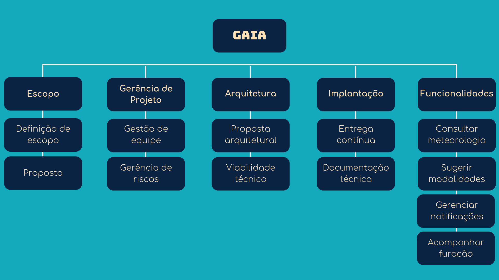
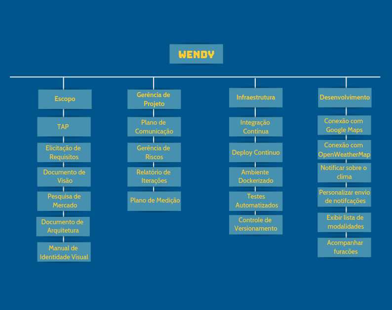

# Estrutura Analítica do Projeto 

## Versão 1.2

## Versão 1.1

## Versão 1.0

# Referências Bibliográficas 

- Criar a Estrutura Analítica do Projeto (EAP); Disponível em: <https://projetoseti.com.br/criar-a-estrutura-analitica-do-projeto-eap/>; Acesso em 04 de maio de 2019.
- Project Management Institute; Um Guia do Conhecimento em Gerenciamento de Projetos (Guia PMBOK). [S. l.]: Biblioteca do Congresso, 2017; Acesso em 04 de maio de 2019.
- Kalkuli, 2018. Termo de Abertura do Projeto. Disponível em: <https://fga-eps-mds.github.io/2018.2-Kalkuli/docs/tap>; Acesso em 22 de março de 2019.
- CarDefense, 2018. Termo de Abertura do Projeto. Disponível em: <https://fga-eps-mds.github.io/2018.2-CarDefense/docs/tap.html>; Acesso em 22 de março de 2019. 