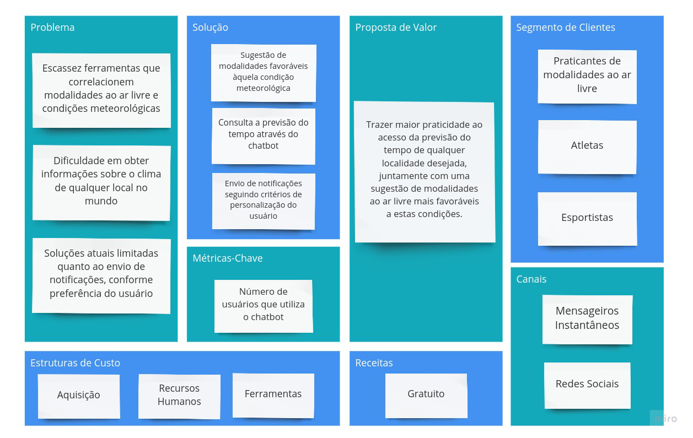

# Canvas do Projeto 

# Referências Bibliográficas 

- Canvas: como estruturar seu modelo de negócio; Disponível em: <http://www.sebrae.com.br/sites/PortalSebrae/ufs/mt/artigos/canvas-como-estruturar-seu-modelo-de-negocio,6a5cc221fcc3a510VgnVCM1000004c00210aRCRD>; Acesso em 04 de maio de 2019.
- Como desenhar um modelo de negócio - Canvas; Disponível em: https://www.youtube.com/watch?v=otov7o9byUk; Acesso em 04 de maio de 2019.