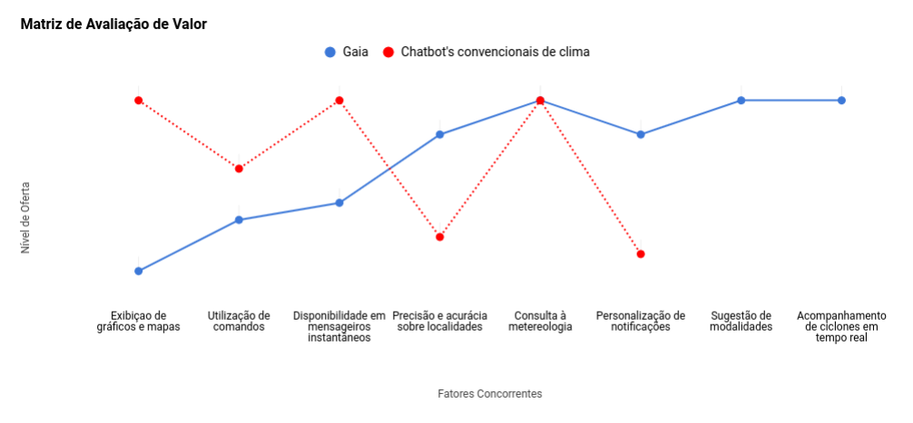
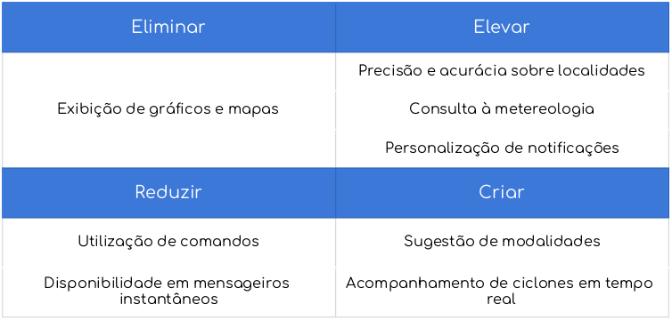

# Análise de Mercado

## Estratégia do Oceano Azul

A estratégia do oceano azul é a busca simultânea de diferenciação e baixo custo para abrir um novo espaço de mercado e criar nova demanda. Trata-se de criar e capturar espaço de mercado não contestado, tornando a concorrência irrelevante. Baseia-se na visão de que os limites do mercado e a estrutura da indústria não são dados e podem ser reconstruídos pelas ações e crenças dos agentes da indústria.

## A Matriz de Avaliação de Valor

A matriz de avaliação de valor é um modelo para o desenvolvimento de uma estratégia consistente de oceano azul. Ela possui dois propósitos, sendo o primeiro captar a situação atual no espaço de mercado conhecido. Isso permite que a empresa compreenda em que os concorrentes estão investindo, os atributos nos quais se baseia a competição em termos de produtos, serviços e entrega, e o que os compradores recebem como clientes de qualquer das ofertas competitivas existentes no mercado. A Figura abaixo retrata de forma gráfica essas informações. O eixo horizontal representa a variedade de atributos nos
quais o setor de Chatbots investe e compete.

## Matriz Eliminar-Elevar-Reduzir-Criar

Esse modelo juda a estruturar a nova matriz de valor do produto através de quatro ações, onde as duas primeiras ações de “reduzir” e “eliminar” desenvolvem novas ideias sobre como otimizar a estrutura de valor em comparação aos concorrentes e as duas outras ações de “criar” e “elevar” se destinam criação de novos atributos agregadores de valor para a organização.

# Referências Bibliográficas 

- KIM, Chan W.; MAUBORGNE, Renée; A estratégia do oceano azul: Como criar novos mercados e tornar a concorrência irrelevante; Disponível em: <http://ysdronnewstime.weebly.com/uploads/5/9/8/2/59820101/a_estrategia_do_oceano_azul_-_w._chan_kimm.pdf>; Acesso em 30 de abril de 2019.
- Blue Ocean Strategy. Disponível em: <https://www.blueoceanstrategy.com>; Acesso em 30 de abril de 2019. 
- Blue Ocean Strategy & Shift Tools. Disponível em: <https://pt.blueoceanstrategy.com/tools/>; Acesso em 30 de abril de 2019. 