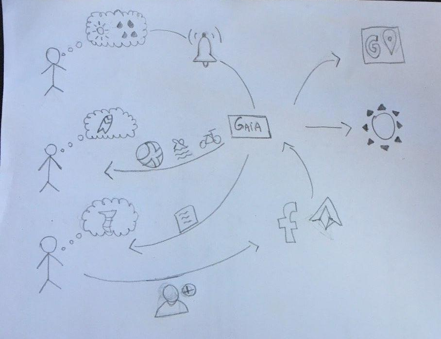

# Backlog do Produto

O Backlog do Produto é uma lista contendo todas as funcionalidades desejadas para o chatbot Gaia. O conteúdo desta lista é definido pelo Product Owner. O Product Backlog não precisa estar completo no início de um projeto. Pode-se começar com tudo aquilo que é mais óbvio em um primeiro momento. Com o passar das sprints, o Product Backlog cresce e muda à medida que se aprende mais sobre o produto e seus usuários. 

Os requisitos do chatbot estão subdivididos em **Épicos**, **Features**, **Histórias de usuário** e **Tasks**. 

## Épicos
EP 01 - Consulta à meteorologia

EP 02 - Sugestão de modalidades

EP 03 - Gerenciamento de notificações

EP 04 - Acompanhamento de ciclones

## Features

| ID | Descrição | Épico |
| -- | --------- | ----- |
| 01 | Exibir previsão do tempo de um local | 01 |  
| 02 | Manter localidade | 01 |
| 03 | Exibir previsão tempo dos próximos 5 dias | 01 |
| 04 | Salvar parâmetros de modalidade | 02 |
| 05 | Relacionar previsão do tempo com modalidades | 02 |
| 06 | Exibir modalidades favoráveis | 02 |
| 07 | Enviar notificações | 03 |
| 08 | Personalizar envio de notificações | 03 |
| 09 | Cancelar envio de notificações | 03 |
| 10 | Enviar alerta de ciclones | 04 |

## Histórias de Usuário
| ID | Descrição | Feature | Épico | Pontos | Prioridade |
| -- | --------- | ------- | ----- | ------ | ---------- |
| 01 | Eu, como usuário, desejo que o sistema obtenha o clima de uma cidade para que eu possa saber as condições climáticas do dia | 01 | 01 | 08 | Alta |
| 02 | Eu, como usuário, desejo que o sistema obtenha a latitute e a logitude de qualquer lugar do mundo a partir da API do Google Maps | 02 | 01 | 13 | Média |
| 03 | Eu, como usuário, desejo interagir com a Gaia para que ela me responda | 01 | 01, 02 | 13 | Alta |
| 04 | Eu, como usuário, desejo que o sistema salve os locais com suas latitudes e longitudes para que o sistema não precise fazer diversas requisições | 02 | 01 | 08 | Média |
| 05 | Eu, como usuário, desejo que a API Clima chame a API Local para que o sistema possa receber o clima do local | 01 | 01 | 05 | Média |
| 06 | Eu, como usuário, desejo obter resposta plausíveis sempre que eu falar com a Gaia para que eu possa manter um diálogo | 01 | 01, 02 | 03 | Alta |
| 07 | Eu, como usuário, desejo que o sistema seja capaz de tratar os dados referentes ao clima para que eu possa entendê-los | 01 | 01 | 05 | Média |
| 08 | Eu, como usuário, desejo que a Gaia me responda de forma coerente | 06 | 01, 02 | 03 | Média |
| 09 | Eu, como usuário, desejo que a Gaia forneça os dados corretos a respeito de clima | 01, 02 | 01 | 13 | Alta |
| 10 | Eu, como usuário, desejo que a Gaia forneça os dados corretos a respeito do esporte | 01, 04, 05, 06 | 01, 02 | 05 | Média |
| 11 | Eu, como usuário, desejo que o sistema consiga filtrar o esporte de acordo com as condições meteorológicas | 04, 05, 06 | 01, 02 | 08 | Alta |
| 12 | Eu, como usuário, desejo que o sistema retorne o local com mais acurácia e precisão | 01, 02, 06 | 01, 02 | 13 | Alta |
| 13 | Eu, como usuário, desejo que o serviço me indique os endpoints | 01, 02, 04, 05 | 02 | 01 | Baixa |
| 14 | Eu, como usuário, desejo que a gaia consiga guardar meus dados e minhas preferências | 07, 08 | 03 | 08 | Alta |
| 15 | Eu, como usuário, desejo que a Gaia me informe se um determinado esporte é favorável de ser realizado ou não | 05, 06 | 02 | 03 | Alta |
| 16 | Eu, como usuário, desejo agendar uma notificação | 07, 08 | 03 | 08 | Alta |
| 17 | Eu, como usuário, desejo que o sistema consiga a previsão de até cinco dias | 03 | 02 | 03 | Média |
| 18 | Eu, como usuário, desejo que o sistema Gateway seja capaz de gerenciar minhas requisições de esporte | 05, 06 | 02 | 05 | Média |
| 19 | Eu, como usuário, desejo que a Gaia me responda com mais acurácia e precisão | 03, 06 | 01, 02 | 03 | Média | 
| 20 | Eu, como usuário, desejo ver mais opções de local caso a minha não esteja não lista | 02 | 01, 02 | 05 | Baixa | 
| 21 | Eu, como usuário, desejo que o sistema trate das opções de local repetidas | 01, 02 | 01, 02 | 03 | Baixa |
| 22 | Eu, como usuário, desejo saber a previsão do tempo de um determinado horário ou local de no máximo 5 dias | 01, 03 | 01, 02 | 05 | Alta |
| 23 | Eu, como usuário, desejo que o sistema me notifique quando eu desejar | 07, 08 | 03 | - | Alta |
| 24 | Eu, como usuário, desejo que o Gateway trate minhas requisições | 01, 02, 04, 07 | 02, 04 | - | Baixa |
| 25 | Eu, como usuário, desejo que o Gateway autentique minhas requisições | 01, 02, 04, 07 | 01, 02, 03, 04 | - | Baixa |
| 26 | Eu, como usuário, desejo que o sistema faça uma nova requisição a cada 2 horas no Ciclone | 10 | 04 | - | Alta |
| 27 | Eu, como usuário, desejo manter minhas notificações | 07, 08, 09 | 03 | - | Alta |
| 28 | Eu, como usuário, desejo manter meus alertas de ciclone | 10 | 04 | - | Média |

 

# Técnicas de Elicitação Utilizadas

## 1. Brainstorming

&emsp;&emsp;O Brainstorming é uma técnica de reunião bem difundida na Engenharia de Requisitos. Ela consiste em um grupo de pessoas de diferentes áreas levantando opiniões e trocando ideias sobre determinado assunto. O Brainstorming foi utilizado pela equipe de EPS para pensar em quais seriam as principais funcionalidades de cada microsserviço. Assim, os cinco microsserviços que existem na arquitetura do bot e o chat possuem um objetivo geral. A partir desse funcionalidade principal foram elicitados outros requisitos.

## 2. Introspecção

&emsp;&emsp;A introspecção é uma técnica muito utilizada na etapa de elicitação. Ela consiste em entender as funcionalidades importantes de um sistema. Apesar de muito usada nem sempre a introspecção traz uma visão próxima da realidade, para evitar isso a Product Owner esteve presente na elicitação levando em conta a sua visão do produto.

## 3. Rich Picture

&emsp;&emsp; Rich Pictures são artefatos que são, geralmente, elaborados na fase de pré-rastreabilidade. Eles são desenhos, feitos a mão ou digitalmente, que representam um sub-sistema de um sistema maior. Rich Pictures procuram mostrar todas as partes externas ou internas, envolvidas em um fluxo do problema. Esse artefato costuma ser bastante informal e auxilia bastante na identificação das partes envolvidas no problema. 

 

# Resultados

## 1. Clima

- O sistema deve ser capaz de fazer requisições para a api do OpenWeatherMaps;
- O sistema deve ser capaz de indicar o clima atual de um local;
- O sistema deve ser capaz de indicar o clima dos próximos cinco dias de um local;
- O sistema deve ser capaz de receber requisições do Gateway;

## 2. Local

- O sistema deve ser capaz de fazer requisições para a api OpenCage Geocoder;
- O sistema deve ser capaz de indicar a latitude e longitude de uma cidade a partir do seu nome;
- O sistema deve ser capaz de filtrar o resultado da requisição da API externa, para obter a localização correta;
- O sistema deve ser capaz de guardar a latitude e longitude de uma cidade;
- O sistema deve ser capaz de localizar no banco de dados a localização de uma cidade;

## 3. Notificação

- O sistema deve ser capaz de criar novo usuário;
- O sistema deve ser capaz de guardar as preferências de notificação do usuário;
- O sistema deve ser capaz de receber uma lista de cidades associada a um usuário;
- O sistema deve ser capaz de notificar o usuário de acordo com a preferência dele;
- O sistema deve ser capaz de cancelar notificações;
- O sistema deve ser capaz de excluir uma cidade;
- O sistema deve ser capaz de excluir um usuário;
- O sistema deve ser capaz de excluir a lista de cidade de um usuário;

## 4. Esporte

- O sistema deve ser capaz de guardar as condições climáticas ideais para cada esporte;
- O sistema deve ser capaz de comparar o clima atual com as condições climáticas ideais do esporte;
- O sistema deve ser capaz de exibir uma lista com os esportes ideias para o clima.

## 5. API GATEWAY

- O sistema deve ser capaz de fazer a integração entre os microsserviços;
- O sistema deve ser capaz de integrar o chatbot com os microsserviços;
- O sistema deve ser capaz de priorizar requisições;

## 6. Requisitos não funcionais

- O sistema deve ter integração com o Telegram;
- O sistema deve ter integração com o Facebook;
- O sistema deve conversar com o usuário em linguagem natural;
- O sistema deve respeitar a personalidade do bot;
- O sistema deve aprender novos comportamentos de acordo com a resposta do usuário;
