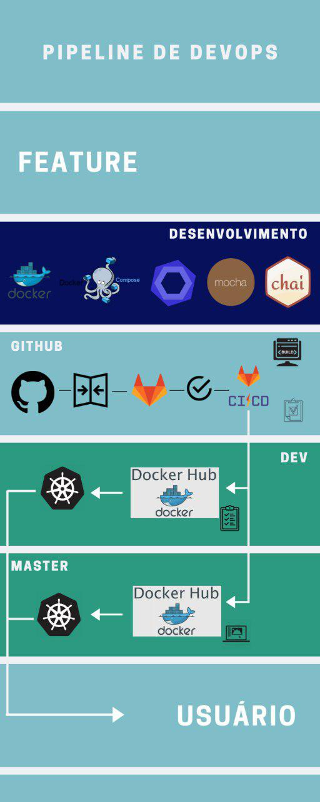

# Pipeline de entrega

A pipeline de entrega tem como objetivo apresentar o fluxo de uma funcionalidade, desde o seu desenvolvimento até chegar ao usuário final.

---

## Ferramentas

### Docker

Docker é uma ferramenta para isolar um ambiente de desenvolvimento através de containers. Estamos utilizando essa ferramenta para alguns propósitos: isolar o ambiente de desenvolvimento, padronizar o ambiente de todos os desenvolvedores, facilitar na integração contínua e no deploy.

### Docker Compose

O Docker Compose é uma ferramenta que utiliza o docker. O Docker Compose é o que chamamos de orquestrador de containers. Essa ferramenta é utilizada somente em ambiente de desenvolvimento, com ela é possível subir vários containers de um vez e criar regras de comunicação entre eles. Estamos utilizando o Docker Compose principalmente para subir serviços que possuem banco de dados.

### Mocha e Chai

São nossas ferramentas para testes unitários em Javascript, já que todos os nossos microsserviços se encontram nessa linguagem. Os testes são de fundamental importância para garantir que ao incluir ou alterar um alguma funcionalidade, não acabe prejudicando outra.

### Eslint

Já para a ferramenta de testes estático estamos utilizando o Eslint, com o padrão do <b>airbnb-base</b>. O Eslint está sendo utilizado para garantir que o código esteja padronizado com o da comunidade Javascript.

### Gitlab CI

Nossa ferramenta para integração contínua, Gitlab CI. Como estamos utilizando o Github como forge principal, configuramos o Gitlab CI para fazer o mirror e assim poder executar o Gitlab CI. O nosso Gitlab CI está rodando basicamente 4 stages, sendo eles: build, test, quality e deploy. Os 3 primeiros rodam a cada commit, e eles garantem a qualidade e a confiabilidade do código. Já o deploy roda somente na dev e na master, ele build o serviço e dá um push para o Docker Hub.

### Docker Hub

Essa ferramenta é utilizada para disponibilizar as imagens dos containers, ele funciona como um git para imagens. Atualmente nossas imagens estão todas públicas através desse link: https://hub.docker.com/u/caleberios

### Kubernets

O Kubernets é outro orquestrador de containers, mas diferente do Docker Compose que é muito utilizado para o ambiente de desenvolvimento, o Kubernetes é utilizado para homologação e produção. Através dele que estamos disponibilizando nossos serviços para todos os usuários finais.

