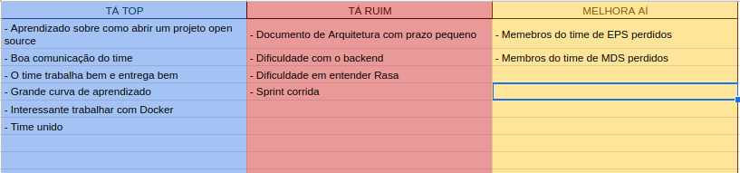

# RESULTADOS da Sprint 1 

O objetivo da Sprint 1 foi instruir o time de MDS para que o Documento de Visão e o Documento de Arquitetura fossem finalizados. EPS deveria preparar o ambiente para que MDS pudesse começar a codar na próxima sprint e subir os documentos criados.

### Presentes na reunião 16/3/19

| Nome | Status |
| --------- | -------- |
| Amanda | sim |
| Calebe | sim |
| Eduardo | sim |
| Indiara | sim |
| Luciana | sim |
| Luís | sim |
| Micaella | sim |
| Samuel | sim |
| Sofia | sim |

## Review

### Issues entregues

| Issues | Pontos |
| --------- | -------- |
| Documento de Visão     | 5 |
| Docker de Buscar Local    | 13       |
| Docker de Buscar Clima    | 13       |
| TAP | 3 |
| EAP | 5 |
| Subir licença | 1 |
| Definição da arquitetura do Projeto | 13 |
| Construir a Wiki do projeto | 8 |

### Issues não entregues

|Issues | Pontos |
| --------- | --------- |
| Documento de Arquitetura | 13 |
| Pipeline DevOps | 3 |
| Docker do Rasa | 13 |
| Roadmap de cada papel de EPS | 3 |

### Total de pontos planejados: 93

#### Pontos entregues: 61

#### Pontos de dívida para a próxima sprint: 32 

## Burndown

## Velocity

## Retrospectiva: Aprendizados obtidos na Sprint 1 

# Burndown de Riscos 

### Observações levantadas ao longo da reunião:

- Todos os membros de MDS participaram da construção direta de pelo menos um item. 
- O documento de arquitetura não foi finalizado 
- Amanda apresentou para MDS como funcionará a arquitetura do projeto
- Calebe tem que passar as versões das tecnologias
- O guia de identidade visual será dividida entre MDS e Tech Lead. MDS serão responsáveis pela personalidade do bot. Tech Lead pelos outros tópicos. 
   

## Avaliação Tech Lead

Enquanto Tech Lead, é importante fazer algumas análises. O time de EPS cometeu alguns erros enquanto gerentes, o primeiro e talvez crucial para que o Documento de Arquitetura se tornasse uma dívida técnica, foi o fato de ter demorado para entregar o template do Documento para o time de MDS. Além disso, o time de EPS deve estar atendo ao fato de que grande parte das dívidas dessa sprint são por sobrecarga do DevOps, então devem estar atentos a isso.

Analisando o Burndown é possível perceber que devido a ociosidade presente nos primeiros dias de Sprint, foi gerada uma sobrecarga ao final, fazendo com que o time não tivesse um bom nível de produtividade. Analisando o Burndown mais a fundo, é perceptível que o que realmente gerou esse gráfico foi a desorganização e falta de entregas contínuas do time de EPS. 

Outro ponto que é importante ficar de olho é a respeito da grande diferença de pontos entre a Sprint 0 e Sprint 1, porém como o time ainda está se ajustando e se conhecendo, é normal que a pontuação seja discrepante. É importante apenas manter o controle para que o time planeje e consiga entregar, e não vire uma bola de neve.
 

A respeito do time de MDS, eles estão trabalhando bem e são muito unidos, aparemente está ocorrendo tudo bem.
