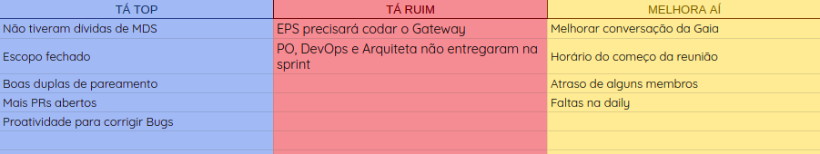
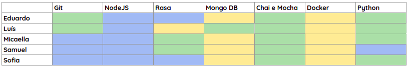
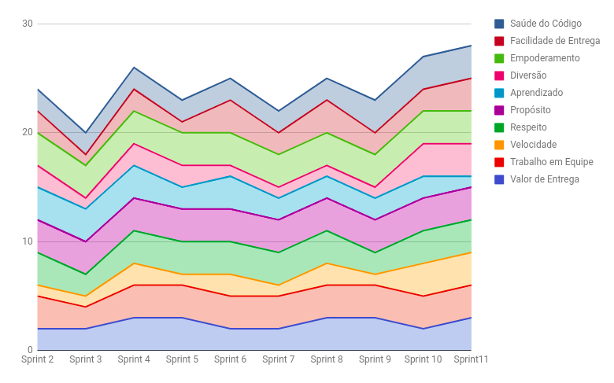
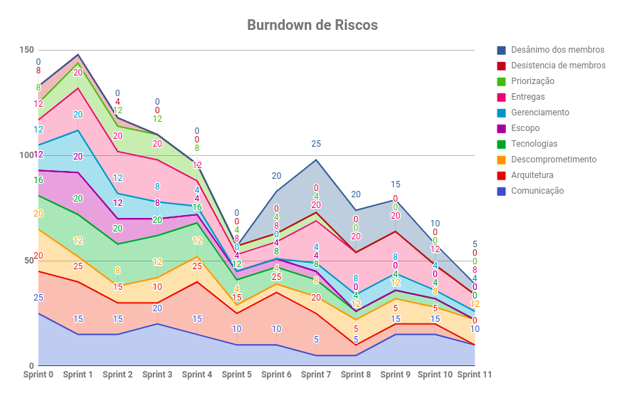

# RESULTADOS da Sprint 11

### Presentes na reunião 08/06/19

| Nome | Status |
| --------- | -------- |
| Amanda | sim |
| Calebe | sim |
| Eduardo | sim |
| Indiara | sim |
| Luciana | sim |
| Luís | sim |
| Micaella | sim |
| Samuel | sim |
| Sofia | sim |

## Review

### Issues entregues

| Issues | 
| --------- |
| US25: Eu como usuário desejo que o Gateway autentique minhas requisições |
| US26: Eu como usuário desejo que o sistema faça uma nova requisição a cada 2 horas |
| US28: Eu como usuário desejo manter minhas notificações de ciclone | 
| US27: Eu, como usuário, desejo manter minhas notificações |
| Configurar o Kibana com Elasticsearch |

### Issues não entregues 

| Issues | 
| --------- | 
| Documentar os resultados do teste de usabilidade |
| Estudar testes de integração |

### Total de issues planejadas: 6

### Issues entregues: 4

### Dívidas para a próxima sprint: 2

## Retrospectiva: Aprendizados obtidos na *Sprint 11* 

## Quadro de Conhecimento 

## Health Check 

## Burndown de Riscos 

## Avaliação Tech Lead

    Foi na sprint 11 que paramos de gerar o burndown. Essa decisão foi tomada devido ao fato da equipe não estar mais pontuando as issues. Para fazer a análise do andamento do projeto ao longo das sprints foi escolhido a utilização do Comulative Flow, um gerador de diversas métricas a partir da utilização do kanban. É possível ver o Comulative Flow do projeto no repositório principal.  

   

    Outro fator marcante nessa sprint foi o fato do time de MDS não ter deixado nenhuma dívida técnica, o que não acontecia a um bom tempo. Na sprint 11 diversos riscos caíram ou foram completamente mitigados, isso mostra um amadurecimento constante do time como um todo. 
    Fazendo uma última análise, no Health Check é possível ver uma constância em todos os aspectos, exceto no aprendizado, que diminuiu. Isso da minha perspectiva representa uma equipe que não está mais recebendo tantos desafios e que entrega com facilidade.  

