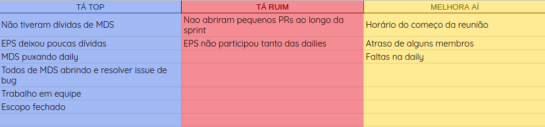
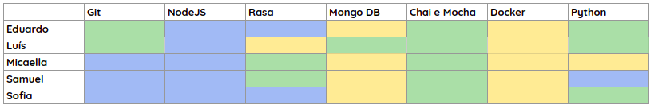
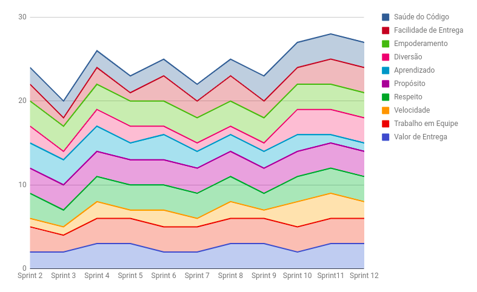
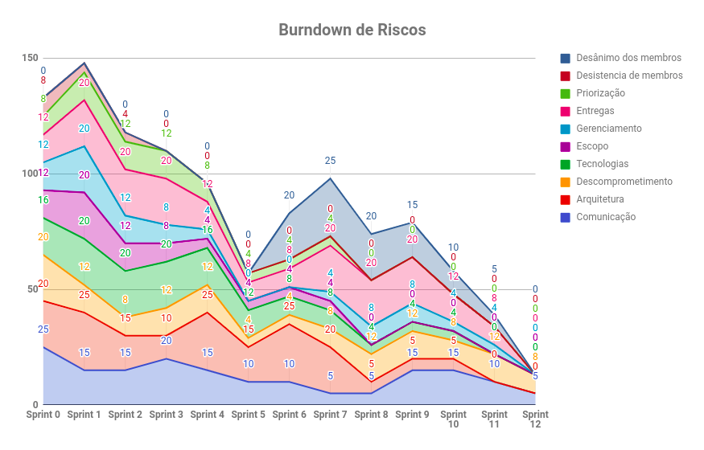

# RESULTADOS da Sprint 11

### Presentes na reunião 15/06/19

| Nome | Status |
| --------- | -------- |
| Amanda | sim |
| Calebe | sim |
| Eduardo | sim |
| Indiara | sim |
| Luciana | sim |
| Luís | sim |
| Micaella | sim |
| Samuel | sim |
| Sofia | sim |

## Review

### Issues entregues

| Issues | 
| --------- |
| Eu como usuário desejo ser notificado quando tiver um ciclone no mundo |   
| Melhorar o fluxo de conversa de esporte |
| Melhorar o fluxo de conversa de ciclone |
| Verificar o procedimento para subir a Gaia no Facebook |
| Estudar testes de integração |
| Documentar os resultados do teste de usabilidade |

### Issues não entregues 

| Issues | 
| --------- | 
| Criar README do ciclone |

### Bugs

| Bugs |
| ---- |
| Bug de autenticar notificação |
| Bug ao salvar ciclone |

### Total de issues planejadas: 7

### Issues entregues: 6

### Dívidas para a próxima sprint: 1

## Retrospectiva: Aprendizados obtidos na *Sprint 12* 

## Quadro de Conhecimento 

## Health Check 

## Burndown de Riscos 

## Avaliação Tech Lead

    Pela segunda Sprint seguida o time de MDS não deixou dívidas. Isso representa um comprometimento e responsabilidade maior, além de um conhecimento satisfatório para entregar com mais facilidade. 
    Na Sprint 12 MDS começou a fazer mais do que o esperado, puxando dailyes, marcando reuniões, criando issues e resolvendo bugs proativamente. O time está se tornando cada vez mais horizontal e autogerenciável. Nessa sprint o que brilhou foi o trabalho em equipe de todos os membros.  

   

    Boa parte dos riscos foram mitigados, o amadurecimento da equipe é nítido. 

