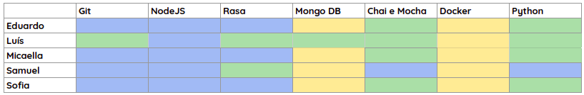
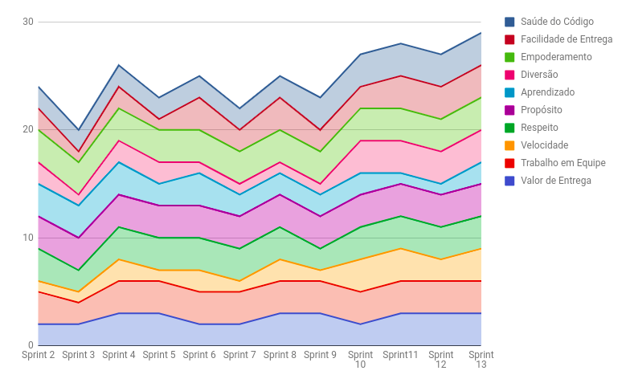
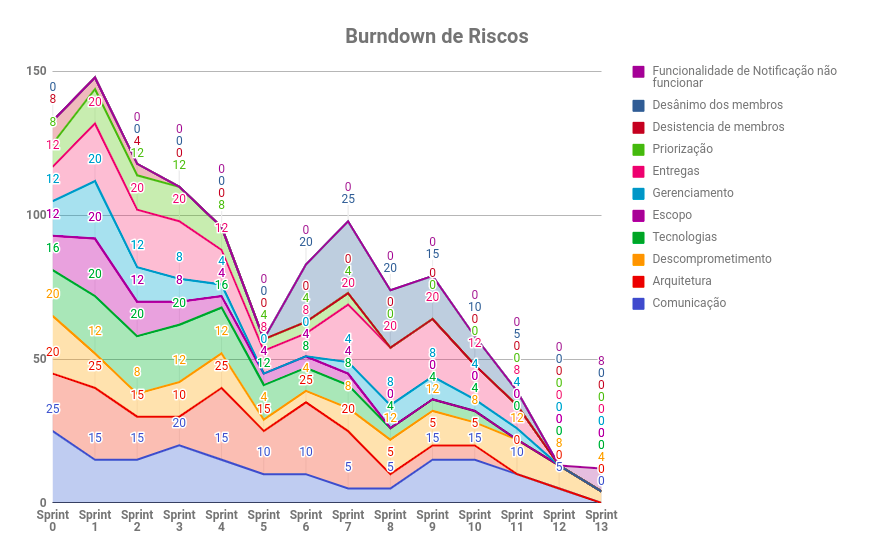

# RESULTADOS da Sprint 13

### Presentes na reunião 24/06/19

| Nome | Status |
| --------- | -------- |
| Amanda | sim |
| Calebe | sim |
| Eduardo | sim |
| Indiara | sim |
| Luciana | sim |
| Luís | sim |
| Micaella | sim |
| Samuel | sim |
| Sofia | sim |

## Review

### Issues entregues

| Issues | 
| --------- |
| Consertar a notificação |
| Adicionar novos esportes |
| Melhorar a conversa da gaia |
| Consertar a gaia no facebook |
| Melhorar a cobertura de testes |
| Melhorar os READMEs |
| Refatorar os diagramas |
| Revisar todos os documentos |
| Colocar todas as tarefas nas issues passadas de devops |
| Criar documentação da folha de estilo |
| Começar o post mortem |
| Colocar critérios de aceitação em todas as issues passada |

### Total de issues planejadas: 13

### Issues entregues: 13

## Quadro de Conhecimento 

## Health Check 

## Burndown de Riscos 

## Avaliação Tech Lead

    Essa é a Sprint final e com isso o projeto chega ao final. O Health Check foi o maior até então, em que a maioria dos aspectos receberam a pontuação máxima. 

   

    Mais alguns riscos foram mitigados ou diminuídos, porém um novo risco surgiu, o risco da equipe não conseguir entregar a funcionalidade de notificação. A pesar do risco, a equipe conseguiu entregar a funcionalidade, sendo assim, se houvesse uma próxima sprint, esse risco seria mitigado. 

    Existem muitas coisas a serem ditas e elas estão todas no nosso Post Mortem. 

## [Post Mortem](projeto/postMortem.md) 