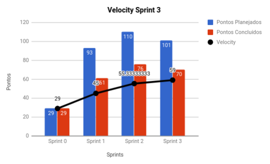
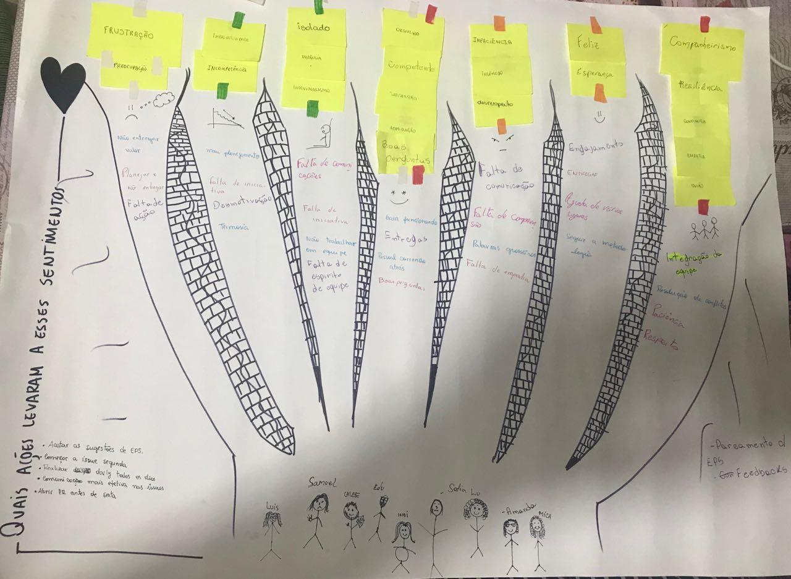
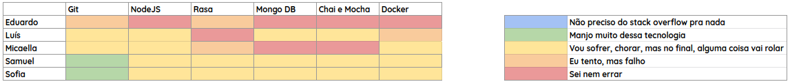
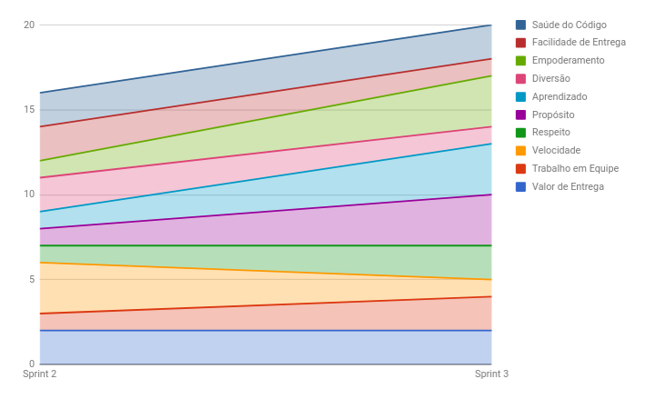

# RESULTADOS da Sprint 3

### Presentes na reunião 13/04/19

| Nome | Status |
| --------- | -------- |
| Amanda | sim |
| Calebe | sim |
| Eduardo | sim |
| Indiara | sim |
| Luciana | sim |
| Luís | sim |
| Micaella | sim |
| Samuel | sim |
| Sofia | sim |

## Review

### Issues entregues

| Issues | Pontos | Time |
| --------- | -------- | -------- |
| US03: Eu como usuário desejo interagir com a Gaia para que ela me responda. | 13 | MDS |
| Padrões de software | 8 | EPS |
| Integração contínua da gaia | 8 | EPS |
| Priorizar backlog  | 5 | EPS |
| Refinar os requisitos em US e tasks | 13 | EPS |
| Organizar o backlog | 3 | EPS |
| Definir conselheiro  | 8 | EPS |
| Métricas de produtividade  | 5 | EPS |
| Documentar planejamento da sprint 3 | 1 | EPS |
| Documentar resultados da sprint 2 | 3 | EPS |
| Guia de comunicação | 3 | EPS |

### Issues não entregues 

| Issues | Pontos | Time |
| --------- | -------- | -------- |
| Analisar riscos do projeto | 5 | EPS | 
| Treinamento de testes | 5 | EPS |
| Definir como seré a integração entre os microsserviços | 8 | EPS |
| US04: Eu como usuário desejo que o sistema salve os locais com suas latitudes e longitudes para que o sistema não precise fazer diversas requisições | 8 | MDS |
| US05: Eu como usuário desejo que a API Clima chame a API Local para que o sistema possa receber o clima do local. | 5 | MDS |

### Total de pontos planejados: 101

### Pontos entregues: 70

### Pontos de dívidas para a próxima sprint: 31

## Burndown

## Velocity

## Retrospectiva: Aprendizados obtidos na *Sprint 3* 

Utilizando uma dinâmica de retrospectiva obtida no site [Knowledge](https://www.knowledge21.com.br), o time levantou uma série de sentimentos que surgiram ao longo da sprint e os agrupou por similaridade. Então cada um desenhou um boneco de palito que o representasse, isso gerou várias risadas. E no caminho entre o time os sentimentos o que acreditamos que possa ter nos levados a esses sentimentos. Ao final elencamos o que pode ser feito para que os sentimentos bons continuassem e os sentimentos ruins acabassem. 

#### Sentimentos negativos:

 

| Frustração | Preocupação |
| ---- | ---- |

| Improdutividade | Incompetência |
| - | - |

| Isolado | Distância | Individualismo |
| - | - |  - |

| Impaciência | Incômodo | Desrespeito |
| - | - | - |

 

#### Sentimentos positivos: 

 

| Orgulho | Competente | Satisfação | Admiração | Boas perguntas |
| - | - | - | - | - |

| Feliz | Esperança |
| - | - |

|Companheirismo | Resiliência | Confiança | Empatia | União |  
| - | - | - | - | - |

 

## Quadro de Conhecimento 

## Health Check 

# Burndown de Riscos 

### Observações levantadas ao longo da reunião

* Foi reduzida a quantidade de tarefas de EPS, levando em conta que as entregas estavam sendo prejudicadas, principalmente pelo tempo usado para ajudar MDS.
* A mudança de equipe para o pareamento das dívidas técnicas ocorreu por problemas ocorridos na sprint passada e EPS enxergou  que inserir o Eduardo no time poderia ajudar de forma efetiva na estrega das dívidas. 

## Avaliação Tech Lead

Ao longo da Sprint 3 mais métricas foram adicionadas para auxiliar nas tomadas de decisão. Ao longo das sprints anteriores o burndown já demonstrava um certo problema no planejamento da equipe e o velocity corroborava com essa hipótese. E assim como nas anteriores, na Sprint 3 também restaram em torno de 30 pontos de dívida técnica, pela terceira vez ocorreu o mesmo erro de planejamento, a atenção sobre isso deve ser dobrada para as próximas sprints.

Um ponto interessante sobre essa sprint é a comparação do quadro de conhecimento atual com o da Sprint 2, em que houve uma queda relativamente grande no quesito "conhecimento". Isso demonstra uma certa maturidade vinda de MDS, que conseguiu enxergar que o conhecimento que eles possuem não é tanto quando eles imaginavam, mostra que essa sprint foi um choque de realidade

Na Sprint 2 não foi possível ver o gráfico no Health Check por ser a primeira vez em que foi coletado, porém agora é possível visualizar uma melhora em muitos quesitos, sendo que o único que regrediu foi a <b>velocidade</b> no quesito velocidade de entrega.

É preciso estar bem atento às próximas sprints para que os erros do projeto sejam diminuídos e a produtividade aumente. Porém a equipe está trabalhando muito bem, tanto o time de EPS quanto de MDS. EPS tenta constantemente trazer as tomadas de decisão para perto de MDS, assim como explicar e justificar toda e qualquer decisão tomada no projeto.
