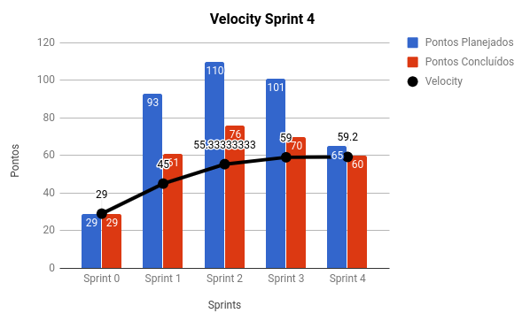
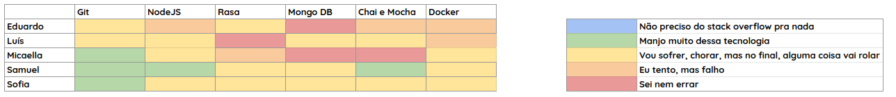

# RESULTADOS da Sprint 4

### Presentes na reunião 20/04/19

| Nome | Status |
| --------- | -------- |
| Amanda | sim |
| Calebe | sim |
| Eduardo | sim |
| Indiara | sim |
| Luciana | sim |
| Luís | sim |
| Micaella | sim |
| Samuel | sim |
| Sofia | sim |

## Review

### Issues entregues

| Issues | Pontos |
| --------- | -------- |
| US06: Eu como usuário desejo obter resposta plausíveis sempre que eu falar com a Gaia para que eu possa manter um diálogo | 3 |
| US07: Eu como usuário desejo que o sistema seja capaz de tratar os dados referentes ao clima para que eu possa entende-los. | 5 |
| Evoluir documento de arquitetura | 1 |
| Deploy Local homologação | 3 |
| Deploy Clima homologação | 3 |
| Passar toda a integração contínua para o gitlab-ci | 3 |
| Definir parâmetros para as modalidades | 5 |
| Evoluir documento de visão e protótipos | 1 |
| Planejar Sprint 4 | 1 |
| Documentar resultados da Sprint 3 | 3 |
| Evoluir plano de métricas | 1 | 
| Analisar riscos do projeto | 5 |
| Treinamento de testes em NodeJS | 5 |
| Definir como será a integração entre os microsserviços | 8 |
| US04: Eu como usuário desejo que o sistema salve os locais com suas latitudes e longitudes para que o sistema não precise fazer diversas requisições | 8 |
| US05: Eu como usuário desejo que a API Clima chame a API Local para que o sistema possa receber o clima do local | 5 |

### Issues não entregues 

| Issues | Pontos |
| --------- | -------- |
| Deploy da Gaia para homologação | 5 |

### Total de pontos planejados: 65

### Pontos entregues: 60

### Pontos de dívidas para a próxima sprint: 5

## Burndown

## Velocity

## Retrospectiva: Aprendizados obtidos na *Sprint 5* 

## Quadro de Conhecimento 

# Health Check 

# Burndown de Riscos 

## Avaliação Tech Lead

Analisando os dados obtidos nas sprints passadas foi possível observar um padrão a respeito da produtividade, onde as entregas não condizem com o planejado. Pensando nisso, o númedo de issues foi diminuido com o intuito de que as entregas sejam realizadas de forma produtiva. Analisando os dados obtidos na Sprint 4 foi possível ver que deu certo diminuir a quantidade de issues. Apesar da produtividade não ter sindo a mais adequada, pode-se ver uma melhora do time nesse aspecto.
 

Pelo Burndown de Riscos é possível ver que um risco que cresceu muito foi a mudança arquitetural que sofreu uma mudança significativa e que não era planejado. Porém os outros riscos estão sendo mitigados aos poucos e consequentemente estão diminuindo.
  