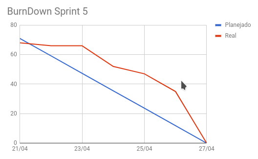
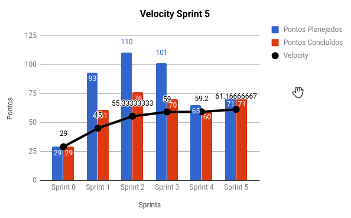
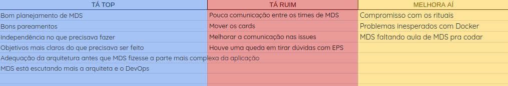
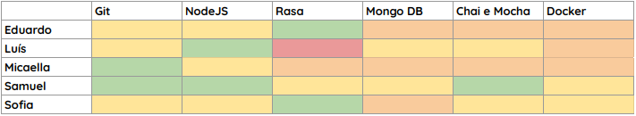
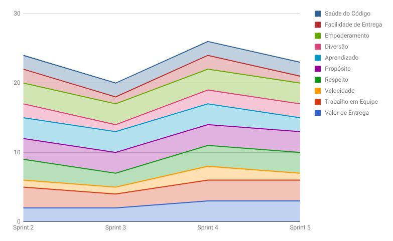
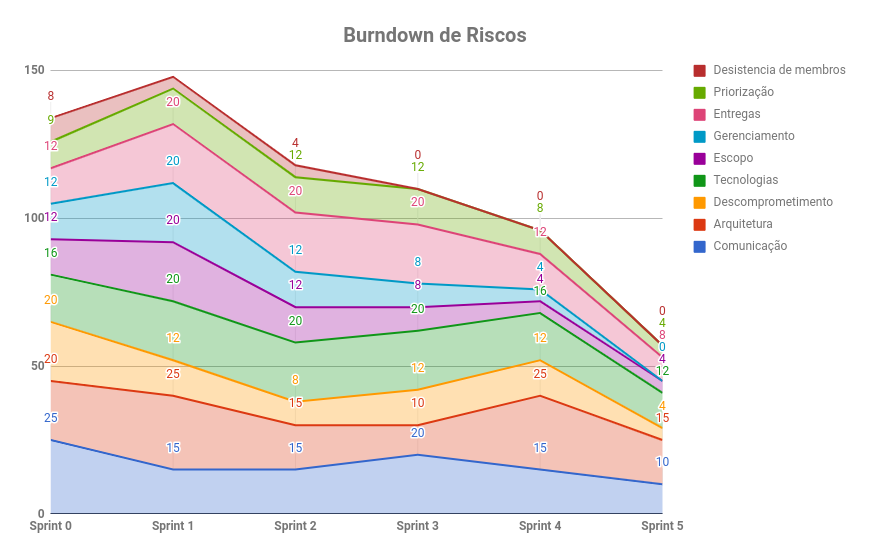

# RESULTADOS da Sprint 5

### Presentes na reunião 20/04/19

| Nome | Status |
| --------- | -------- |
| Amanda | sim |
| Calebe | sim |
| Eduardo | sim |
| Indiara | sim |
| Luciana | sim |
| Luís | sim |
| Micaella | sim |
| Samuel | sim |
| Sofia | sim |

## Review

### Issues entregues

| Issues | Pontos |
| --------- | -------- |
| US08 - Eu como usuário desejo que a Gaia me responda de forma coerente | 3 |
| US09 - Eu como usuário desejo que a Gaia forneça os dados corretos a respeito de clima | 13 |
| US10 - Eu como usuário desejo que a Gaia forneça os dados corretos a respeito do esporte | 5 |
| US11 - Eu como usuário desejo que o sistema consiga filtrar o esporte de acordo com as condições meteorológicas | 8 |
| US12 - Eu como usuário desejo que o sistema retorne o local com mais acurácia e precisão | 13 |
| Documentação da folha de estilo | 3 | 
| Estudo da parte de composição da API Gateway | 5 |
| Evoluir os diagramas de classe e pacote | 1 |
| Alterar o Docker para aceitar esporte | 3 |
| Criar repositório da API Gateway | 1 |
| Deploy de esporte em homolog | 3 |
| Enriquecer a tabela de esportes | 1 |
| Documentar técnicas de requisitos | 3 |
| Documentar planning da sprint 5 | 1 |
| Documentar resultados da sprint 4 | 3 |
| Deploy da Gaia para homologação | 5 |

### Issues não entregues 

**Notas as issues foram entregues**

### Total de pontos planejados: 71

### Pontos entregues: 71

### Pontos de dívidas para a próxima sprint: 0

## Burndown

## Velocity

## Retrospectiva: Aprendizados obtidos na *Sprint 5* 

## Quadro de Conhecimento 

## Health Check 

## Burndown de Riscos 

## Avaliação Tech Lead

Direfentemente do que estava ocorrendo nas sprints anteriores, MDS melhorou consideravelmente as entregas, isso é nítido no Burndown por ser uma sprint que caminhou bem e que entregaram todas as histórias planejadas, além das dívidas técnicas. Para a sprint 5 houveram muitas issues e para que as entregas fossem constantes e que não houvessem dívidas para a próxima sprint, o time de EPS optou por organizar as entregas por dia e funcionou muito bem.
 

Na Sprint 5 todos os riscos diminuíram, inclusive o risco de gerenciamento foi completamente mitigado e isso ocorreu devido ao fato de que o time de EPS está conseguindo melhorar os indicadores e elevar a produtividade do time de MDS.
