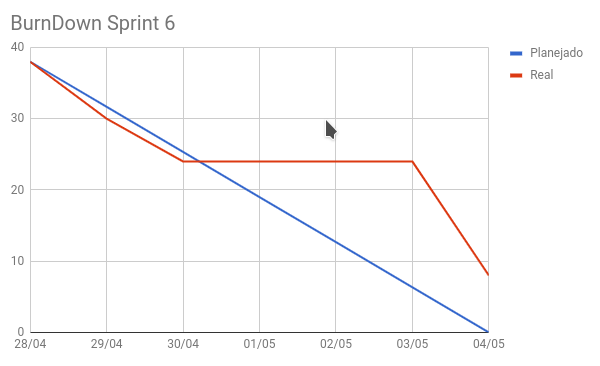
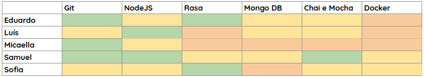
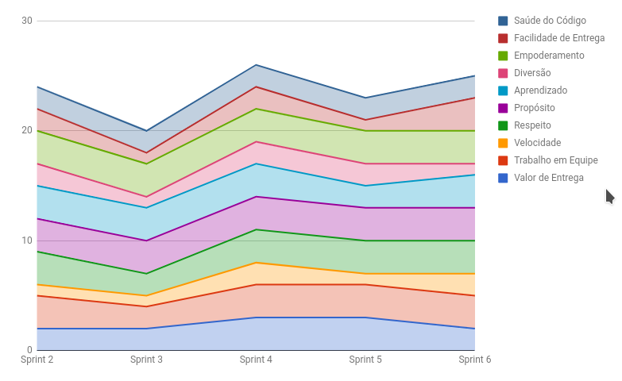
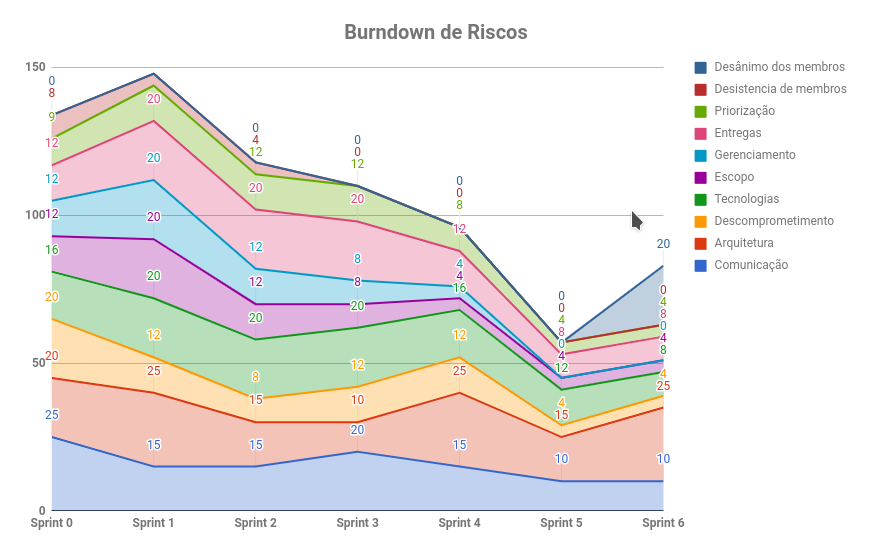

# RESULTADOS da Sprint 6

### Presentes na reunião 04/05/19

| Nome | Status |
| --------- | -------- |
| Amanda | sim |
| Calebe | sim |
| Eduardo | sim |
| Indiara | sim |
| Luciana | sim |
| Luís | sim |
| Micaella | sim |
| Samuel | sim |
| Sofia | sim |

## Review

### Issues entregues

| Issues | Pontos |
| --------- | -------- |
| US15: Eu como usuario desejo que a gaia me informe se um determinado esporte eh favoravel de ser realizado ou nao | 5 |
| Justificativa da definição da arquitetura | 3 |
| Criar matriz de valor | 3 |
| Criar roadmap geral | 5 |
| Entregar o Pipeline de DevOps | 3 |
| Estudar EVM | 1 |
| Definir tarefas que serão feitas na API Gateway | 5 |
| Documentar Resultados da Sprint 5 | 3 |
| Documentar Planejamento da Sprint 6 | 1 |
| Olhar todos os serviços e ver o que precisa ser melhorado | 1 |

### Issues não entregues 

| Issues | Pontos |
| --------- | -------- |
| US14: Eu como usuario desejo que a gaia consiga guardar meus dados e minhas preferencias | 8 |

### Total de pontos planejados: 38

### Pontos entregues: 30

### Pontos de dívidas para a próxima sprint: 8

## Burndown

## Velocity

## Retrospectiva: Aprendizados obtidos na *Sprint 6* 

## Quadro de Conhecimento 

## Health Check 

## Burndown de Riscos 

## Avaliação Tech Lead

Ao contrário da Sprint 5, a Sprint 6 foi um pouco conturbada. Até o dia 30, que foi o dia da nossa apresentação da R1, a entrega estava contínua e seguindo o burndown, porém a partir do dia 31, as entregas pararam e só voltaram a ocorrer no dia 03/05, 1 dia antes de fechar a sprint. Isso ocorreu devido à exaustão causada na sprint anterior.

Foi nessa sprint que um novo risco surgiu <b>Desânimo dos Membros</b>, onde a maior preocupação é o desanimo tanto dos membros de MDS quanto de EPS. Nessa sprint também ocorreu um grande aumento no risco da arquitetura, por ocorrer uma mudança de última hora.
