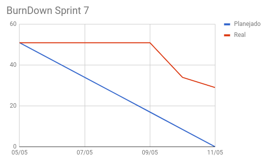
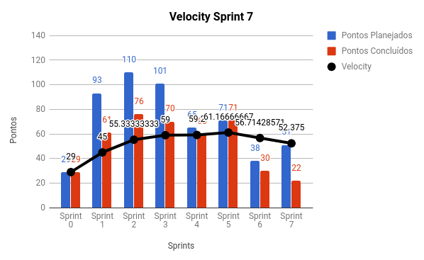
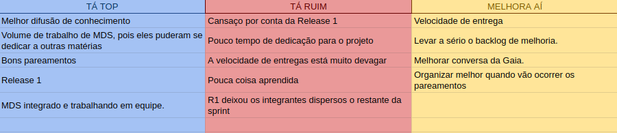
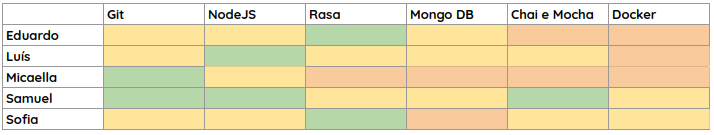
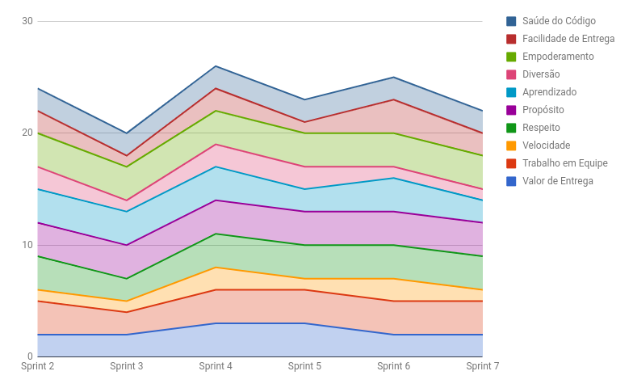
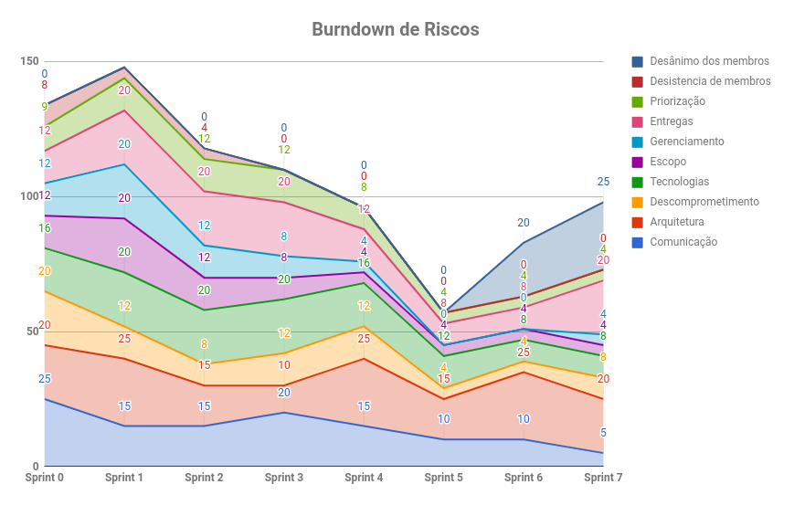

# RESULTADOS da Sprint 7

### Presentes na reunião 11/04/19

| Nome | Status |
| --------- | -------- |
| Amanda | sim |
| Calebe | não |
| Eduardo | sim |
| Indiara | não |
| Luciana | não |
| Luís | sim |
| Micaella | sim |
| Samuel | sim |
| Sofia | sim |

## Review

### Issues entregues

| Issues | Pontos |
| --------- | -------- |
| US14 - Eu como usuario desejo que a gaia consiga guardar meus dados e minhas preferencias  | 8 | 
| US17 - Eu como usuário desejo que o sistema consiga a previsão de até cinco dias | 3 |
| US18 - Eu como usuário desejo que o sistema Gateway seja capaz de gerenciar minhas requisições de esporte | 5 |
| Adicionar referencial bibliográfico nos artefatos | 1 |
| Documentar planejamento da Sprint 7 | 1 |
| Documentar resultados da Sprint 6 | 3 |
| Adicionar cobertura de testes dos microsserviço | 1 |

### Issues não entregues 

| Issues | Pontos |
| --------- | -------- |
| US16 - Eu como usuário desejo agendar uma notificação | 5 |
| US19 - Eu como usuário desejo que a Gaia me responda com mais acurácia e precisão | 3 |
| Definir microsserviço do ciclone | 5 |
| Criar EVM | 5 | 
| Configurar deploy contínuo | 3 |
| Criar fluxograma principal de interação da Gaia | 5 |
| Subir o mongo no Kubernets | 3 |

### Total de pontos planejados: 51

### Pontos entregues: 22

### Pontos de dívidas para a próxima sprint: 29

## Burndown

## Velocity

## Retrospectiva: Aprendizados obtidos na *Sprint 7* 

## Quadro de Conhecimento 

## Health Check 

## Burndown de Riscos 

### Observações levantadas ao longo da reunião

Reunião feita em duas partes para que todos os integrantes de MDS pudessem participar. Sem três integrantes de EPS.

## Avaliação Tech Lead

A Sprint 7 foi até o momento a mais complicada. O time não entregou nada nos primeiros 4 dias de sprint. Isso por si só não demostra muita coisa, porém, ao analisar o velocity, é possível ver como o planejado e o entregue são tão discrepantes. Isso aconteceu devido ao cansaço da R1, a produtividade caiu e houveram poucas entregas.

Com todos esses problemas alguns riscos aumentaram. O risco de desânimo dos membros aumentou e as entregas também, e o time de EPS está atento e se planejando para resolver esse problema.

Na Sprint 7 ocorreu um evento em que 3/4 membros do time de EPS tiveram que participar, deixando a reunião da sprint a cargo de uma única pessoa de EPS. O time tentou mitigar esse risco separando antecipadamente o que os membros de MDS teriam que fazer na próxima sprint, também organizando um pequeno roteiro do que precisaria ser feito na reunião.
