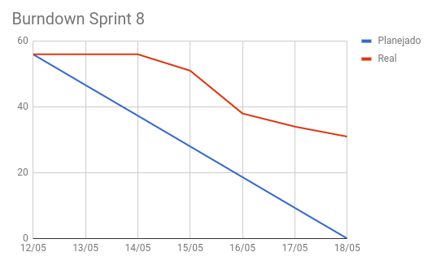
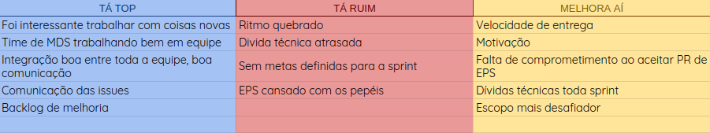
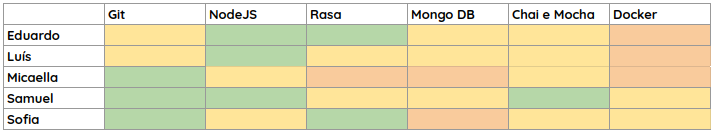
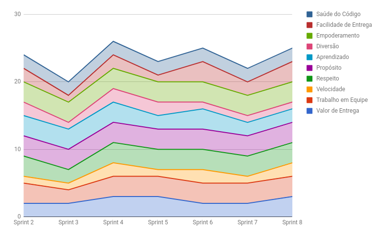
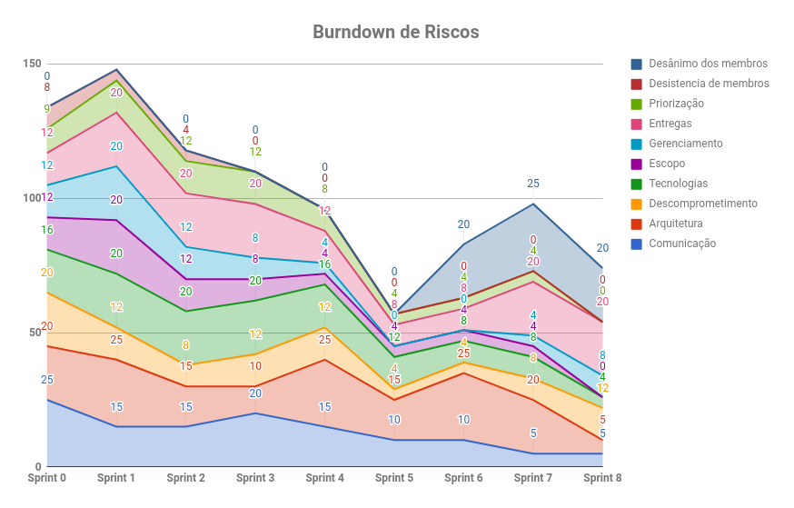

# RESULTADOS da Sprint 8

### Presentes na reunião 18/05/19

| Nome | Status |
| --------- | -------- |
| Amanda | sim |
| Calebe | sim |
| Eduardo | sim |
| Indiara | não |
| Luciana | sim |
| Luís | sim |
| Micaella | sim |
| Samuel | sim |
| Sofia | sim |

## Review

### Issues entregues

| Issues | Pontos |
| --------- | -------- |
| Configurar deploy contínuo | 3 |
| Realizar alterações de melhoria no microsserviço Gaia-Clima | 3 |
| Alterar as rotas da Gaia - BUG | 1 |
| Verificar a viabilidade de saber se a cidade é litorânea ou não | 3 |
| US21: Eu como usuário desejo que o sistema trate das opções de local repetidas | 3 |
| Subir o mongo no Kubernets | 3 |
| US16-Eu como usuário desejo agendar uma notificação | 5 |
| Documentar planejamento da Sprint 8 | 1|
| Documentar resultados da Sprint 7 | 3 |

### Issues não entregues 

| Issues | Pontos |
| --------- | -------- |
| US20: Eu como usuário desejo ver mais opções de local caso a minha não esteja não lista | 5 |
| US22: Eu como usuário desejo saber a previsão do tempo de um determinado horário ou local de no máximo 5 dias | 5 |
| US23: Eu como usuário desejo que o sistema me notifique quando eu desejar | 8 |
| Criar EVM | 5 |
| Definir microsserviço do ciclone | 5 | 
| US19 -Eu como usuário desejo que a Gaia me responda com mais acurácia e precisão | 3 |

### Total de pontos planejados: 56

### Pontos entregues: 25

### Pontos de dívidas para a próxima sprint: 31

## Burndown

## Retrospectiva: Aprendizados obtidos na *Sprint 8* 

## Quadro de Conhecimento 

## Health Check 

## Burndown de Riscos 

## Avaliação Tech Lead

A sprint 8 foi um pouco preocupante, o time de MDS deixou muitas dívidas técnicas, com isso o risco das entregas contínuou muito alto. Para reverter isso, EPS planejou para a sprint seguinte a sprint de forma mais leve para que eles pudesse se concentrar nas dívidas da sprint anterior. Segundo o que foi levantado na retrospectiva, a comunicação entre o time por meio de issues melhorou, por isso houve uma diminuição do risco de comunicação.
