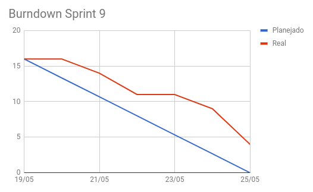
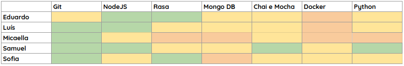
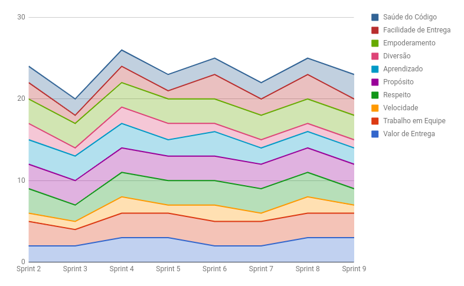
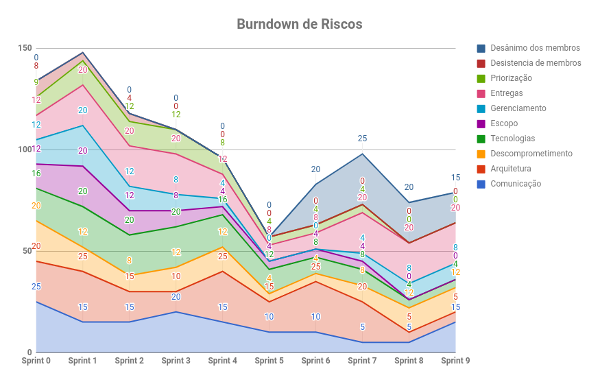

# RESULTADOS da Sprint 9

### Presentes na reunião 25/05/19

| Nome | Status |
| --------- | -------- |
| Amanda | sim |
| Calebe | sim |
| Eduardo | sim |
| Indiara | sim |
| Luciana | sim |
| Luís | sim |
| Micaella | sim |
| Samuel | sim |
| Sofia | sim |

## Review

### Issues entregues

| Issues | Pontos |
| --------- | -------- |
| US19 -Eu como usuário desejo que a Gaia me responda com mais acurácia e precisão | 3 |
| US20: Eu como usuário desejo ver mais opções de local caso a minha não esteja não lista | 5 |
| US22: Eu como usuário desejo saber a previsão do tempo de um determinado horário ou local de no máximo 5 dias | 5 |
| Definir microsserviço do ciclone | 5 |
| Alterar as requisições para o Axios em todos os microsserviços | 1 |
| Planejar teste de usabilidade | - | 
| Estudar como coletar metricas do bot | - |
| Estudar deploy para facebook messenger | - |
| Passar Gaia-Local para Gaia-Esporte | - |
| Refatorar os Gitlab CIs | - |
| Realizar alterações de melhoria no microsserviço Gaia-Local | 3 |
| Criar e configurar novo repositorio | - |

### Issues não entregues 

| Issues | Pontos |
| --------- | -------- |
| Refatorar arquitetura | - |
| Criar EVM | 5 |
| US23: Eu como usuário desejo que o sistema me notifique quando eu desejar | - |
| Melhorar fluxo da Gaia | - | 
| Passar Gaia-Notifica para Gaia-Esporte | - |
| Passar Gaia-Clima para Gaia-Esporte | - |

### Observação: As US24 e US25 foram removidas as sprint para que todas as dívidas pudessem ser entregues.

### Total de issues planejadas: 16

### Número de issues entregues: 12

### Número de dívidas para a próxima sprint: 3

## Burndown

## Retrospectiva: Aprendizados obtidos na *Sprint 9* 

## Quadro de Conhecimento 

## Health Check 

## Burndown de Riscos 

### Observações levantadas ao longo da reunião

## Avaliação Tech Lead

Na Sprint 9 houveram algumas dívidas, porém um número bem menor do que na sprint anterior. A tática de diminuir as issues para que MDS focasse nas dívidas deu certo. Nessa sprint cada pessoa ficou com uma issue, os pareamentos ocorreram de forma orgânica, ou seja, pareavam quando havia algum problema ou dificuldade. Avaliando o Health Check, a equipe pontuou a velocidade de entrega como menor do que a sprint anterior, porém a saúde do código melhorou. Na sprint 9 houve um salto no risco de comunicação, onde a equipe de MDS não se comunicou de forma eficiente. O time de EPS percebeu que os desenvolvedores estavam bem desmotivados, além disso algumas atitudes de MDS não estavam sendo bem vistas, pensando nisso, boa parte da reunião semanal foi utilizada para uma dinâmica de feedback, chamada fearless feedback, onde foram passados feedbacks individualmente e em grupo para cada um.
